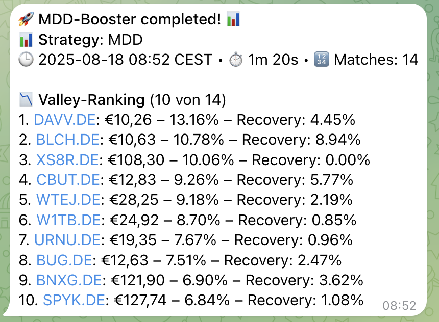
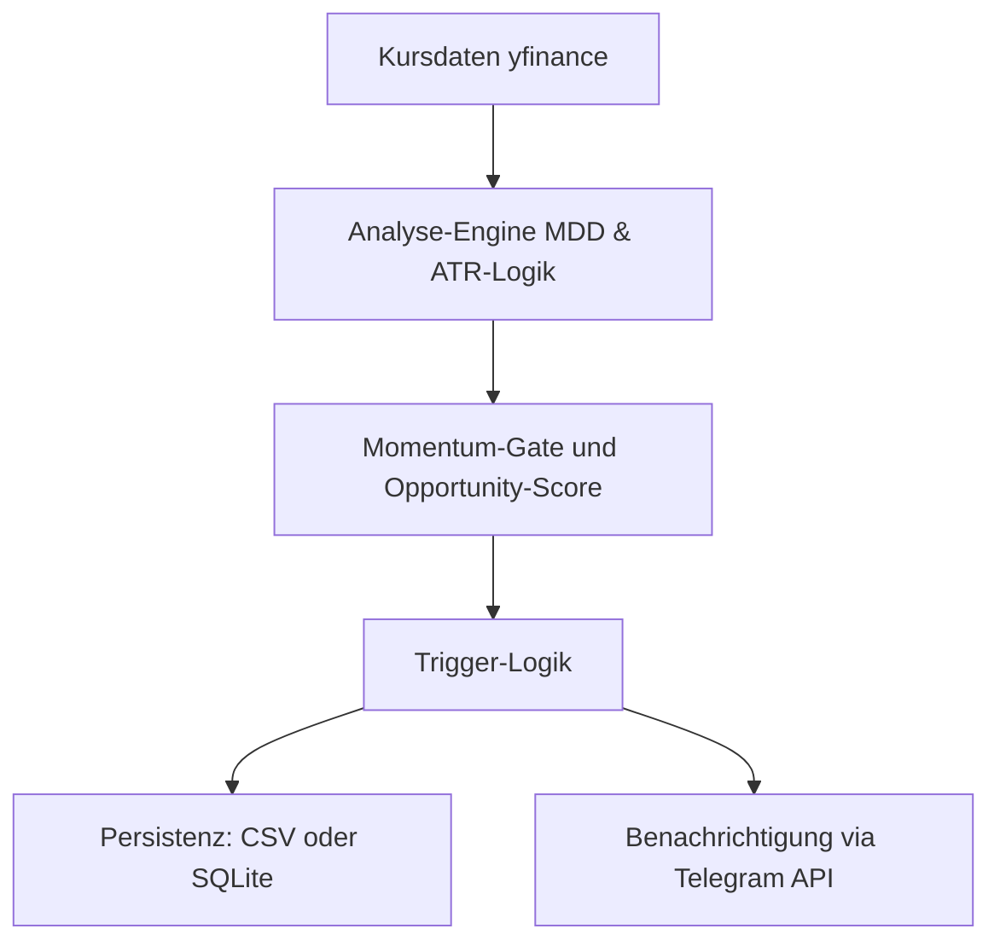

# 📈 ETF Booster – Dokumentation  

Ein modulares **Python-basiertes Monitoring-Tool**, das aktuell über 600 nach Kriterien wie TER gefilterten ETF-Positionen (Datenbestand hat über 2600) überwacht, **antizyklische Kauf-/Verkaufssignale** erkennt und diese per **Telegram-Benachrichtigung** verschickt.  

> ⚠️ **Hinweis:** Dieses Repository dient lediglich **Dokumentations- und Demonstrationszwecken**.  
> Der Quellcode ist vertraulich und wird nicht öffentlich bereitgestellt. Diese Unterlagen dienen zur **Strategie-, Architektur- und Konzeptübersicht**.

---

## 📊 Erste Ergebnisse

📈 Performance: Outperformte den MSCI World um **+4 %** in den ersten 3 Monaten (Performance kann schwanken)  
🧪 Umfangreiche Tests: Mehrere ETFs weltweit, verschiedene Zeitrahmen  
⏳ Status: WIP – Backtesting und Budget-Split-Logik in Entwicklung

---

## 🎯 Zielsetzung
- 🚫 Keine manuelle Marktbeobachtung mehr  
- 🤖 Automatische Identifikation von Kauf- und Verkaufszeitpunkten
- Weniger Handlungen auf Basis von Gefühlen  
- 💰 Steueroptimierte Gewinne durch Freibetrag- und Teilfreistellungslogik  
- 📲 Minimal-invasiv: Benachrichtigt nur bei relevanten Chancen  

---

## 🧠 Strategie-Übersicht
- **Drawdown-Analyse (MDD)**: Erkennung signifikanter Kursrückgänge  
- **ATR-basierte Valley Detection**: Identifikation lokaler Tiefpunkte in Relation zur Volatilität  
- **Momentum-Gates**: Bestätigung durch Aufwärtstrend, um Fehlsignale zu vermeiden  
- **Opportunity-Scoring**: Kombiniert technische Signalqualität, Liquidität und steuerliche Optimierung  

---

## 📸 Demo – Telegram Alert  

  

*Beispiel: Telegram-Benachrichtigung mit Valley-Ranking und Recovery-Infos. Dieser Screenshot dient nicht zur Finanzberatung.*  

---

## 🖥️ Architektur (vereinfachter Überblick)

---

## 🚀 Geplante Erweiterungen  

- 💾 Rebalancing-Vorschläge  
- 🧮 Backtesting der Monats-Empfehlungen  
- 🌐 UI mit Streamlit oder Web-Dashboard  
- 🧠 LLM-Parsing von Transaktionen aus Freitext  

---

## 🛠 Technologien & Tools  

  
  
  
  

---

## 📄 Lizenz & Status  

🔒 **Code privat** – Nur Konzept und Dokumentation öffentlich  
📌 **Status:** Work in Progress  
